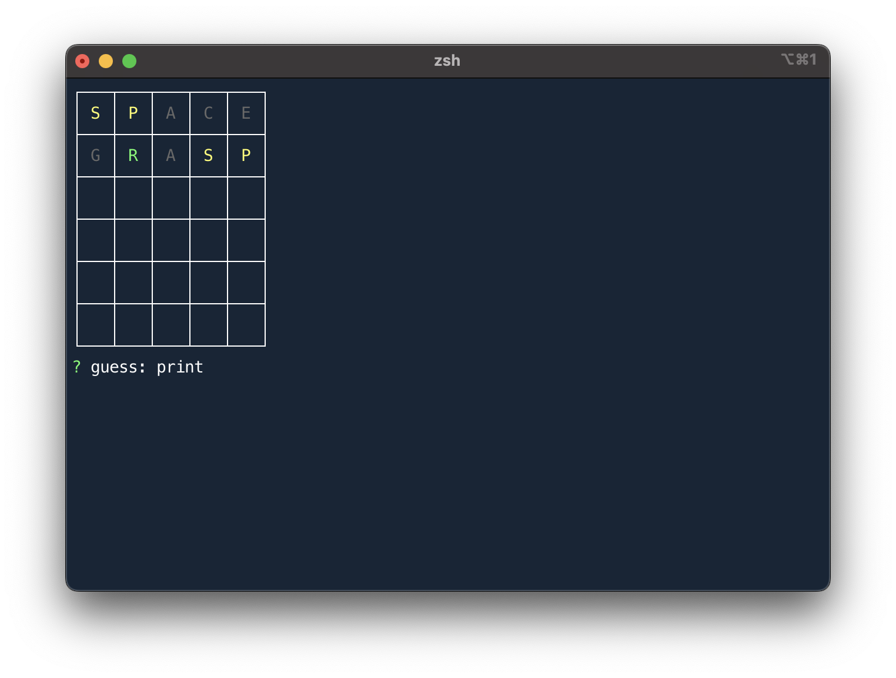

# wordle-cli

## About

A clone of [Wordle](https://www.nytimes.com/games/wordle/index.html) for command line, written in JavaScript.

## Installation & Usage

_Note: Requires [nodejs](https://nodejs.org/en/)!_

Clone or download this repo, navigate to the directory in your terminal, and run `npm i`

Run `node app.js` or `npm start` and enjoy!

## Acknowledgements

Wordle originally created by [Josh Wardle](https://www.powerlanguage.co.uk)

## Dependencies

- [inquirer](https://www.npmjs.com/package/inquirer)
- [chalk](https://www.npmjs.com/package/chalk)
